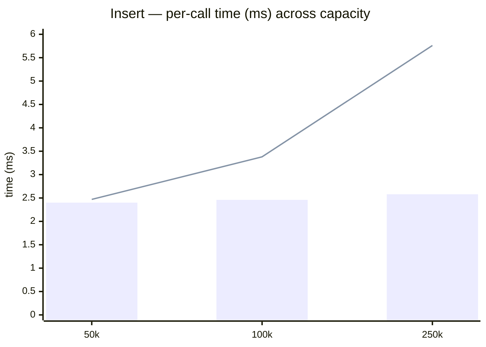

# Insert benchmark

> Run date: 2026-06-25 · Source: `benchmarks/bench_insert.cpp`

Per-call cost of `KDTree3::insert` across capacity, batch size,
and FIFO-eviction regime.

## Methodology

- **D = 3, scalar = float**.
- **Cold regime:** fresh `Tree` constructed inside each timed
  iteration, followed by a single batch insert. Reported time includes
  per-tree construction (allocation + zero-fill of five
  `capacity`-sized arrays + `iota` of the FIFO buffer).
- **Warm regime:** `Tree` pre-filled to capacity before measurement;
  only `tree.insert(batch)` is timed via `BENCHMARK_ADVANCED` +
  `Chronometer::measure`. Every measured batch evicts `batch_size`
  FIFO-head occupants.
- **RNG:** `std::mt19937_64` with fixed seeds; `resolution = 1e-6f` so
  dedup never fires. Points are uniform in `[0, 1)^3`.
- **Bench harness:** Catch2 v3.5.4, 20 samples per row.
- **Environment:** Ubuntu 24.04 LTS · Linux 6.17 · Intel Core Ultra 5
  235 (14 cores) · 16 GB RAM · g++ 13.3.0 · CMake 3.31.9 · Release `-O3`.

## Results

20 samples per row. Mean per `insert()` call.

### Cold vs. warm sweep across capacity (batch = 10k)

| Capacity | Regime               | Mean / call |   Stddev | Per-point (mean) |
| -------- | -------------------- | ----------: | -------: | ---------------: |
| 50k      | cold (no eviction)   |     2.40 ms |  38.6 µs |           240 ns |
| 50k      | warm (FIFO eviction) |     2.47 ms |  78.9 µs |           247 ns |
| 100k     | cold (no eviction)   |     2.46 ms |  84.4 µs |           246 ns |
| 100k     | warm (FIFO eviction) |     3.38 ms |   116 µs |           338 ns |
| 250k     | cold (no eviction)   |     2.58 ms |  67.3 µs |           258 ns |
| 250k     | warm (FIFO eviction) |     5.76 ms |   254 µs |           576 ns |

Bars = cold (no eviction). Line = warm (FIFO eviction).

### Cold batch-size sweep

| Capacity | Batch size |  Mean / call |    Stddev | Per-point (mean) |
| -------- | ---------- | -----------: | --------: | ---------------: |
|     100k |        100 |      58.5 µs |   9.79 µs |           585 ns |
|     100k |      1,000 |       292 µs |   22.0 µs |           292 ns |
|     100k |     10,000 |     2.844 ms |   50.0 µs |           284 ns |
|     250k |        100 |       184 µs |   36.6 µs |          1.84 µs |
|     250k |      1,000 |       408 µs |   37.4 µs |           408 ns |
|     250k |     10,000 |     3.020 ms |   93.0 µs |           302 ns |

### Warm (FIFO eviction), small batch into full tree

| Capacity | Prefill | Batch size |  Mean / call |    Stddev | Per-point (mean) |
| -------- | ------- | ---------- | -----------: | --------: | ---------------: |
|     250k |    250k |      1,000 |     1.387 ms |    132 µs |          1.39 µs |

## What this tells us

**Per-tree construction shows up in the small-batch cold rows.** At
`capacity = 250k` the cold `batch = 100` call costs ~184 µs — ~3× the
same insert at `capacity = 100k` (58.5 µs) — even though only 100 points
are written either way. The fixed construction step (allocating and
zero-filling five `capacity`-sized arrays + the FIFO `iota`) scales with
capacity, not batch. At `batch = 10k` the insert work dominates and that
overhead amortizes: per-point falls to ~284–302 ns regardless of
capacity.

**Eviction itself is cheap.** `PointStore::acquire` takes constant
time per insert whether or not a FIFO head is being recycled; per-slot
generation counters bump on every reuse and stale leaf-bucket entries
are skipped at scan time. At small `N` warm tracks cold (50k: 2.47 vs
2.40 ms); the warm-vs-cold gap at larger `N` comes from the end-of-batch
recursive sweep, not from eviction per se.

**Warm scaling** (batch = 10k):
- 50k → 100k (2×): 2.47 → 3.38 ms (~1.4×)
- 100k → 250k (2.5×): 3.38 → 5.76 ms (~1.7×)

The recursive top-down `maybe_partial_rebuild` visits ~N/B nodes per
batch and rebuilds every violator it sees. As `N` grows, the sweep's
own walk cost stays small (sub-millisecond) but the chance of a
medium-sized violator firing rises, which is what drives the
super-linear warm trend.

**SLAM implication.** Per-batch budget at 10 Hz is ~100 ms. Every
measured capacity (50k–250k) sits well inside the budget — 250k warm
takes ~5.8 ms.
