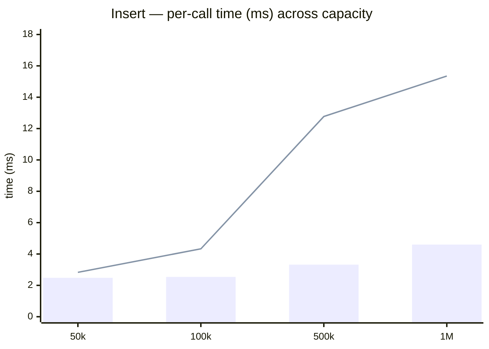

# Insert benchmark

> Run date: 2026-05-14 · Source: `benchmarks/bench_insert.cpp`

Per-call cost of `FixedKdTree3::insert` across capacity, batch size,
and FIFO-eviction regime.

## Methodology

- **D = 3, scalar = float**.
- **Cold regime:** fresh `Tree` constructed inside each timed
  iteration, followed by a single batch insert. Reported time includes
  per-tree construction (allocation + zero-fill of five
  `capacity`-sized arrays + `iota` of the FIFO buffer).
- **Warm regime:** `Tree` pre-filled to capacity before measurement;
  only `tree.insert(batch)` is timed via `BENCHMARK_ADVANCED` +
  `Chronometer::measure`. Every measured batch evicts `batch_size`
  FIFO-head occupants.
- **RNG:** `std::mt19937_64` with fixed seeds; `resolution = 1e-6f` so
  dedup never fires. Points are uniform in `[0, 1)^3`.
- **Bench harness:** Catch2 v3.5.4, 5 samples per row.
- **Environment:** Intel Core Ultra 5 235 · Linux 6.17 x86_64 ·
  g++ 13.3.0 · CMake 3.31.9 · Release `-O3`.

## Results

5 samples per row. Mean per `insert()` call.

### Cold vs. warm sweep across capacity (batch = 10k)

| Capacity | Regime               | Mean / call |   Stddev | Per-point (mean) |
| -------- | -------------------- | ----------: | -------: | ---------------: |
| 50k      | cold (no eviction)   |     2.48 ms |  19.7 µs |           248 ns |
| 50k      | warm (FIFO eviction) |     2.83 ms |   101 µs |           283 ns |
| 100k     | cold (no eviction)   |     2.54 ms |  37.0 µs |           254 ns |
| 100k     | warm (FIFO eviction) |     4.33 ms |   260 µs |           433 ns |
| 500k     | cold (no eviction)   |     3.32 ms |  17.9 µs |           332 ns |
| 500k     | warm (FIFO eviction) |    12.77 ms |   1.65 ms|          1.28 µs |
| 1M       | cold (no eviction)   |     4.60 ms |  67.7 µs |           460 ns |
| 1M       | warm (FIFO eviction) |    15.35 ms |   535 µs |          1.54 µs |

Bars = cold (no eviction). Line = warm (FIFO eviction).

### Cold batch-size sweep

| Capacity | Batch size |  Mean / call |    Stddev | Per-point (mean) |
| -------- | ---------- | -----------: | --------: | ---------------: |
|     100k |        100 |      49.5 µs |   4.02 µs |           495 ns |
|     100k |      1,000 |     289.5 µs |   18.8 µs |           290 ns |
|     100k |     10,000 |     2.966 ms |   38.5 µs |           297 ns |
|       1M |        100 |     11.15 ms |    154 µs |           112 µs |
|       1M |      1,000 |     11.49 ms |    242 µs |          11.5 µs |
|       1M |     10,000 |     14.41 ms |    184 µs |          1.44 µs |

### Warm (FIFO eviction), small batch into full tree

| Capacity | Prefill | Batch size |  Mean / call |    Stddev | Per-point (mean) |
| -------- | ------- | ---------- | -----------: | --------: | ---------------: |
|       1M |      1M |      1,000 |     5.257 ms |    576 µs |          5.26 µs |

## What this tells us

**Per-tree construction dominates cold time at large capacity.** At
`capacity = 1M` the cold per-call time is ~11–14 ms regardless of
batch size in the 100–10k range; the construction step pays ~11 ms
on its own. At `capacity = 100k` construction shrinks below the batch
cost, and per-point time drops from 495 ns (batch 100) to 297 ns
(batch 10k) as the fixed overhead amortizes.

**Eviction itself is cheap.** `PointStore::acquire` takes constant
time per insert whether or not a FIFO head is being recycled; per-slot
generation counters bump on every reuse and stale leaf-bucket entries
are skipped at scan time. The warm-vs-cold gap at large `N` comes
from the end-of-batch recursive sweep, not from eviction per se.

**Warm scaling** (batch = 10k):
- 50k → 100k: 2.83 → 4.33 ms (~1.5×) — well sub-`log N`
- 100k → 500k: 4.33 → 12.77 ms (~3×)
- 500k → 1M: 12.77 → 15.35 ms (~1.2×)

The recursive top-down `maybe_partial_rebuild` visits ~N/B nodes per
batch and rebuilds every violator it sees. As `N` grows, the sweep's
own walk cost stays small (sub-millisecond) but the chance of a
medium-sized violator firing rises, which is what drives the
`100k → 500k` jump.

**SLAM implication.** Per-batch budget at 10 Hz is ~100 ms. Every
measured capacity (50k–1M) sits well inside the budget — 1M warm
takes ~15 ms.
