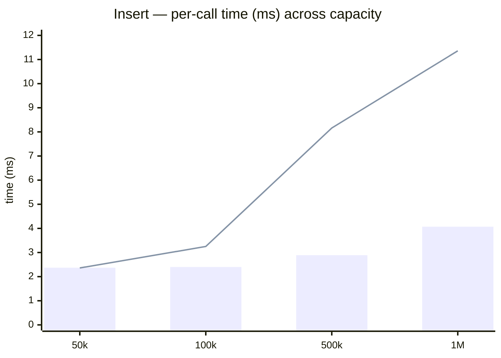

# Insert benchmark

> Run date: 2026-06-17 · Source: `benchmarks/bench_insert.cpp`

Per-call cost of `KDTree3::insert` across capacity, batch size,
and FIFO-eviction regime.

## Methodology

- **D = 3, scalar = float**.
- **Cold regime:** fresh `Tree` constructed inside each timed
  iteration, followed by a single batch insert. Reported time includes
  per-tree construction (allocation + zero-fill of five
  `capacity`-sized arrays + `iota` of the FIFO buffer).
- **Warm regime:** `Tree` pre-filled to capacity before measurement;
  only `tree.insert(batch)` is timed via `BENCHMARK_ADVANCED` +
  `Chronometer::measure`. Every measured batch evicts `batch_size`
  FIFO-head occupants.
- **RNG:** `std::mt19937_64` with fixed seeds; `resolution = 1e-6f` so
  dedup never fires. Points are uniform in `[0, 1)^3`.
- **Bench harness:** Catch2 v3.5.4, 5 samples per row.
- **Environment:** Ubuntu 24.04 LTS · Linux 6.17 · Intel Core Ultra 5
  235 (14 cores) · 16 GB RAM · g++ 13.3.0 · CMake 3.31.9 · Release `-O3`.

## Results

5 samples per row. Mean per `insert()` call.

### Cold vs. warm sweep across capacity (batch = 10k)

| Capacity | Regime               | Mean / call |   Stddev | Per-point (mean) |
| -------- | -------------------- | ----------: | -------: | ---------------: |
| 50k      | cold (no eviction)   |     2.37 ms |  30.4 µs |           237 ns |
| 50k      | warm (FIFO eviction) |     2.36 ms |  29.1 µs |           236 ns |
| 100k     | cold (no eviction)   |     2.40 ms |  31.5 µs |           240 ns |
| 100k     | warm (FIFO eviction) |     3.25 ms |  74.9 µs |           325 ns |
| 500k     | cold (no eviction)   |     2.89 ms |   186 µs |           289 ns |
| 500k     | warm (FIFO eviction) |     8.16 ms |   411 µs |           816 ns |
| 1M       | cold (no eviction)   |     4.07 ms |   340 µs |           407 ns |
| 1M       | warm (FIFO eviction) |    11.36 ms |   276 µs |          1.14 µs |

Bars = cold (no eviction). Line = warm (FIFO eviction).

### Cold batch-size sweep

| Capacity | Batch size |  Mean / call |    Stddev | Per-point (mean) |
| -------- | ---------- | -----------: | --------: | ---------------: |
|     100k |        100 |      59.5 µs |   3.88 µs |           595 ns |
|     100k |      1,000 |       286 µs |   16.8 µs |           286 ns |
|     100k |     10,000 |     2.815 ms |   45.7 µs |           282 ns |
|       1M |        100 |     9.503 ms |    203 µs |          95.0 µs |
|       1M |      1,000 |     9.327 ms |    282 µs |          9.33 µs |
|       1M |     10,000 |     12.31 ms |    316 µs |          1.23 µs |

### Warm (FIFO eviction), small batch into full tree

| Capacity | Prefill | Batch size |  Mean / call |    Stddev | Per-point (mean) |
| -------- | ------- | ---------- | -----------: | --------: | ---------------: |
|       1M |      1M |      1,000 |     3.551 ms |    117 µs |          3.55 µs |

## What this tells us

**Per-tree construction dominates cold time at large capacity.** At
`capacity = 1M` the cold per-call time is ~9–13 ms regardless of
batch size in the 100–10k range; the construction step pays ~9.5 ms
on its own. At `capacity = 100k` construction shrinks below the batch
cost, and per-point time drops from 595 ns (batch 100) to 282 ns
(batch 10k) as the fixed overhead amortizes.

**Eviction itself is cheap.** `PointStore::acquire` takes constant
time per insert whether or not a FIFO head is being recycled; per-slot
generation counters bump on every reuse and stale leaf-bucket entries
are skipped at scan time. At small `N` warm tracks cold (50k: 2.36 vs
2.37 ms); the warm-vs-cold gap at large `N` comes from the end-of-batch
recursive sweep, not from eviction per se.

**Warm scaling** (batch = 10k):
- 50k → 100k: 2.36 → 3.25 ms (~1.4×) — well sub-`log N`
- 100k → 500k: 3.25 → 8.16 ms (~2.5×)
- 500k → 1M: 8.16 → 11.36 ms (~1.4×)

The recursive top-down `maybe_partial_rebuild` visits ~N/B nodes per
batch and rebuilds every violator it sees. As `N` grows, the sweep's
own walk cost stays small (sub-millisecond) but the chance of a
medium-sized violator firing rises, which is what drives the
`100k → 500k` jump.

**SLAM implication.** Per-batch budget at 10 Hz is ~100 ms. Every
measured capacity (50k–1M) sits well inside the budget — 1M warm
takes ~11.4 ms.
