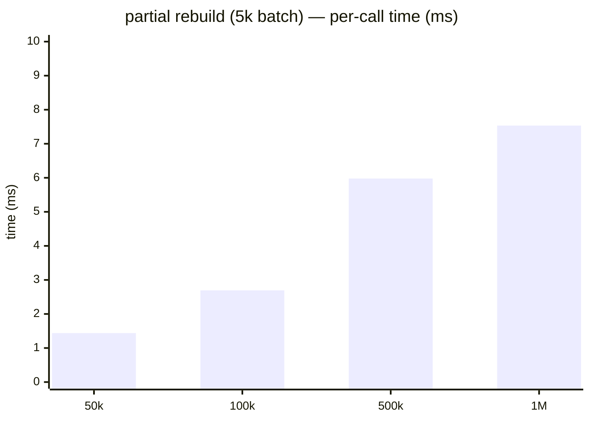
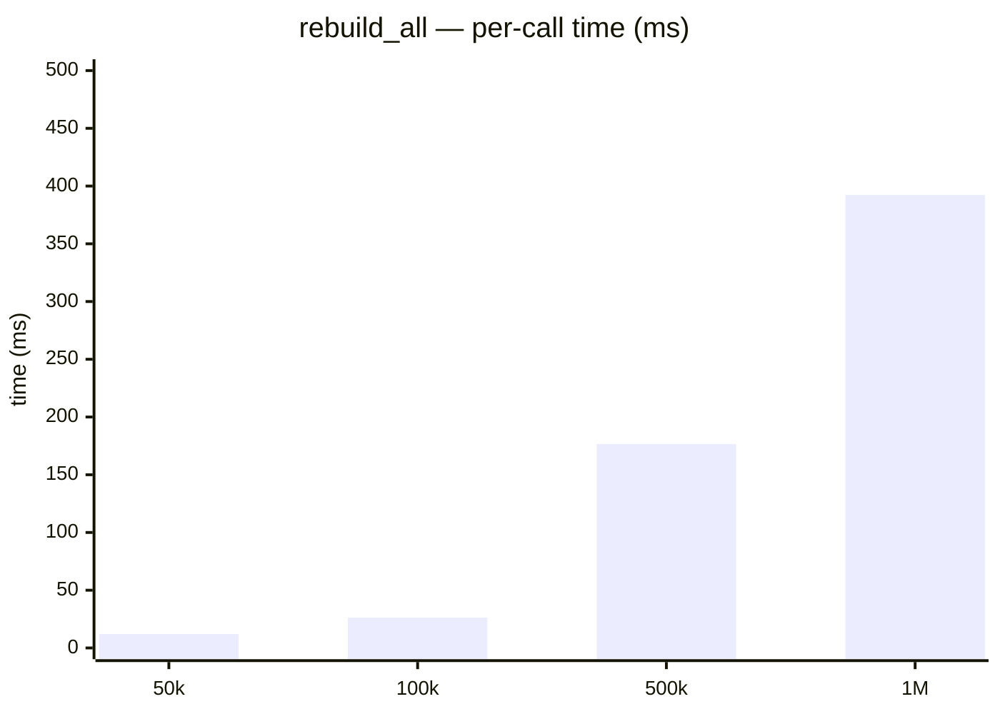

# Rebuild benchmark

> Run date: 2026-05-14 · Source: `benchmarks/bench_rebuild.cpp`

Cost of rebuild paths: steady-state batch insert (which folds in any
partial-rebuild work triggered by α-imbalance / tombstone-fraction /
leaf-overflow), explicit `rebuild_all`, the degenerate
single-leaf-overflow path, and a best-effort tombstone-trigger probe.

## Methodology

- **D = 3, scalar = float**, random points uniform in `[0, 100)^3`.
- **Tree setup:** `capacity = N`, prefilled to `N` before the timed
  iteration.
- **Steady-state partial rebuild:** the timed inner action is one
  `insert(5k)`. Every measured insert evicts FIFO head; the
  end-of-batch `maybe_partial_rebuild` runs a recursive top-down sweep
  and rebuilds every α-imbalance / tombstone / leaf-overflow violator
  in place.
- **`rebuild_all`:** the timed inner action is `tree.rebuild_all()`.
- **Degenerate cluster:** 1k points jittered around a single center
  (`±1e-3` per axis, well above `resolution = 1e-6f`). All routed
  through the same root-side path → repeated `LeafBucket::push`
  overflow → eager-split work.
- **Tombstone trigger:** prefill 1M, remove ~30% of the inserted points
  (coordinates sampled from the prefill so every query matches a live
  point), then measure a 1k batch insert. Best-effort: at least one
  subtree is expected to cross `tombstone_threshold = 0.25`.
- **RNG:** `std::mt19937_64` with fixed seeds; `resolution = 1e-6f`.
- **Bench harness:** Catch2 v3.5.4, 5 samples per row.
- **Environment:** Intel Core Ultra 5 235 · Linux 6.17 x86_64 ·
  g++ 13.3.0 · CMake 3.31.9 · Release `-O3`.

## Results

5 samples per row.

### N sweep — `insert(5k)` (steady state) vs `rebuild_all`

| N    | partial-rebuild batch insert | `rebuild_all` |     Ratio |
| ---- | ---------------------------: | ------------: | --------: |
| 50k  |                     1.437 ms |      12.00 ms |     ~8.3× |
| 100k |                     2.694 ms |      26.27 ms |     ~9.8× |
| 500k |                     5.978 ms |     176.63 ms |     ~30×  |
| 1M   |                     7.534 ms |     392.33 ms |     ~52×  |

### Trigger-specific paths (N = 1M)

| Path                                       | Mean / call |  Stddev |
| ------------------------------------------ | ----------: | ------: |
| degenerate cluster insert (1k batch)       |    2.956 ms |   206 µs|
| tombstone-triggered insert (1k batch, ~30% live points removed prior) |    2.799 ms |   236 µs|

## What this tells us

**Partial rebuild keeps steady-state batch cost well below the full
rebuild reference at every measured N.** A 5k batch insert runs in
single-digit ms, while a `rebuild_all` over the same set scales as
`O(N log N)` and crosses 100 ms at N=500k. The recursive top-down
sweep visits every internal node, but the per-node check is constant
time; total sweep overhead stays sub-millisecond.

**`rebuild_all` scales close to `O(N log N)`.** 50k → 100k (2×): 12.0
→ 26.3 ms (~2.2×). 100k → 500k (5×): 26.3 → 176.6 ms (~6.7×). 500k →
1M (2×): 176.6 → 392.3 ms (~2.2×). The 100k → 500k overshoot above
the analytic 5.6× (= 5 × log scaling) is memory-hierarchy: a 500k+
point/topology working set spills past L3.

**Degenerate cluster insert exercises the eager-split path cheaply.**
A 1k batch where every point clusters within a `1e-3` cube on a
1M-point tree runs in ~3 ms — same order as a uniform 1k insert at
the same N. The `LeafBucket::push` overflow → `rebuild_subtree_in_place`
chain is not a hot spot.

**Tombstone-triggered partial rebuild keeps the batch fast** (~2.8 ms
for the 1k insert after ~30% removal). The trigger fires, the
scapegoat subtree is rebuilt in place, and the surrounding batch
remains well under any reasonable budget.
