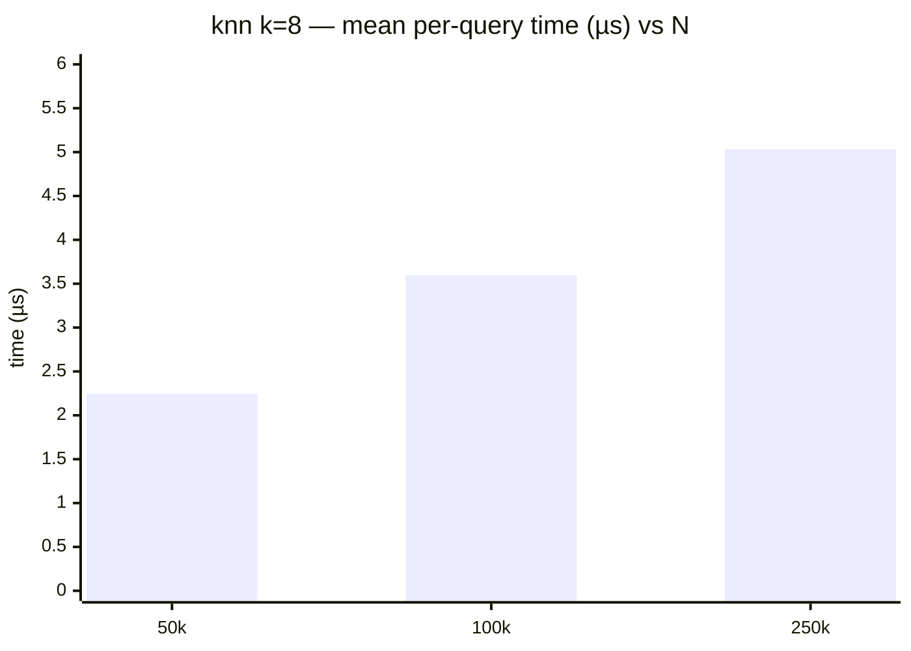

# Search benchmark

> Run date: 2026-06-25 · Source: `benchmarks/bench_search.cpp`

Per-query latency of `KDTree3::knn_search`, `radius_search`,
`hybrid_search`, plus N-sweep + radius-sweep, plus mixed insert/query
cycle throughput.

## Methodology

- **D = 3, scalar = float**. Points uniform in `[0, 100)^3`.
- **Single-query rows:** pre-built tree (`capacity = 250k`, prefilled with
  100,000 points unless noted). Query pool of 256 points drawn from the
  same uniform distribution with a different seed. The timed inner
  action picks a query via atomic round-robin to avoid both RNG cost in
  the hot path and degenerate cache reuse of a single fixed query.
- **N sweep:** tree capacity matches prefill (50k / 100k / 250k);
  `knn_search(q, k=8)` repeatedly with the same 256-point query pool.
- **Radius sweep:** N = 100k tree; `radius_search` at r ∈ {0.5, 2.0,
  5.0, 10.0}.
- **Mixed-cycle rows:** one cycle = one `insert(1k)` followed by 10,000
  `knn_search(q, k=8)` queries. Reported time is the full cycle. Two
  settings: cap = 100k prefilled to 10k; cap = 250k prefilled to 250k.
- **RNG:** `std::mt19937_64` with fixed seeds; `resolution = 1e-6f`.
- **Bench harness:** Catch2 v3.5.4, 20 samples per row.
- **Environment:** Ubuntu 24.04 LTS · Linux 6.17 · Intel Core Ultra 5
  235 (14 cores) · 16 GB RAM · g++ 13.3.0 · CMake 3.31.9 · Release `-O3`.

## Results

20 samples per row.

### Single-query latency (N = 100k prefill)

| Query                       | Mean / call |  Stddev |
| --------------------------- | ----------: | ------: |
| `knn_search` k = 1          |    1.421 µs |   147 ns|
| `knn_search` k = 8          |    4.042 µs |   341 ns|
| `knn_search` k = 32         |    8.221 µs |  1.014 µs|
| `radius_search` r = 5.0     |    9.842 µs |  1.602 µs|
| `hybrid_search` k=32, r=5.0 |    7.313 µs |  1.380 µs|

### knn k=8 across live-point count

| N    | Mean / call |  Stddev |
| ---- | ----------: | ------: |
| 50k  |    2.247 µs |   236 ns|
| 100k |    3.596 µs |   549 ns|
| 250k |    5.031 µs |   376 ns|

### radius_search across r (N = 100k)

| r    | Mean / call |  Stddev |
| ---- | ----------: | ------: |
| 0.5  |      917 ns |   101 ns|
| 2.0  |    2.612 µs |   411 ns|
| 5.0  |    9.484 µs |   777 ns|
| 10.0 |    53.39 µs |  3.734 µs|

### Mixed cycle (1 × insert(1k) + 10,000 × knn_search k=8)

| Prefill | Mean / cycle |   Stddev | Inferred per-query knn |
| ------- | -----------: | -------: | ---------------------: |
|     10k |    10.42 ms  |  64.0 µs |              ~1.0 µs   |
|    250k |    19.18 ms  |   727 µs |              ~1.9 µs   |

## What this tells us

**knn scales sublinearly with both `k` and `N`.** From k=1 to k=32
(32×) is ~5.8× cost (1.42 → 8.22 µs); from N=50k to N=250k (5×) is ~2.2×
cost (2.25 → 5.03 µs). Both trends point at the same mechanism: the
bounded max-heap fills early and tightens the leaf-scan skip threshold,
pruning most of the remaining tree.

**`radius_search` cost scales with the radius (result count).** Over
r ∈ {0.5, 2.0, 5.0, 10.0} on 100k points in `[0, 100)^3` the per-query
mean climbs from ~917 ns to ~53.4 µs (~58×). A larger radius clears the
per-axis split-plane prune test (`diff*diff` vs `sq_radius`) on more
internal nodes, so the traversal descends into — and leaf-scans — a
growing fraction of the tree and collects more matches. At small r the
squared split-plane gap exceeds the sq_radius early, so the descent
stays shallow and most of the tree is pruned.

**`hybrid_search` adds a `k` cap on top of the radius bound.** With
`(k = 32, r = 5.0)` the per-call time (~7.3 µs) sits just under both
`knn k = 32` (~8.2 µs) and `radius_search r = 5.0` (~9.8 µs): the `k`
cap lets the bounded heap tighten the prune threshold sooner than the
radius alone would. The margin over `radius_search` is modest at this
radius (~1.3×) because radius_search is already cheap here — but the
cap matters most when `r` is large enough that the unbounded result set
would balloon (radius_search alone is already ~53 µs at r=10.0).

**Mixed cycle is dominated by the query burst.** The 10k searches
account for the bulk of cycle time at both prefill levels; the 1k
insert contributes a few milliseconds at most. Per-query knn (k=8)
grows from ~1.0 µs at N=10k to ~1.9 µs at N=250k — sublinear in live
count, consistent with the `O(log N)` descent shape with cache-pressure
adjustments at larger working sets.
