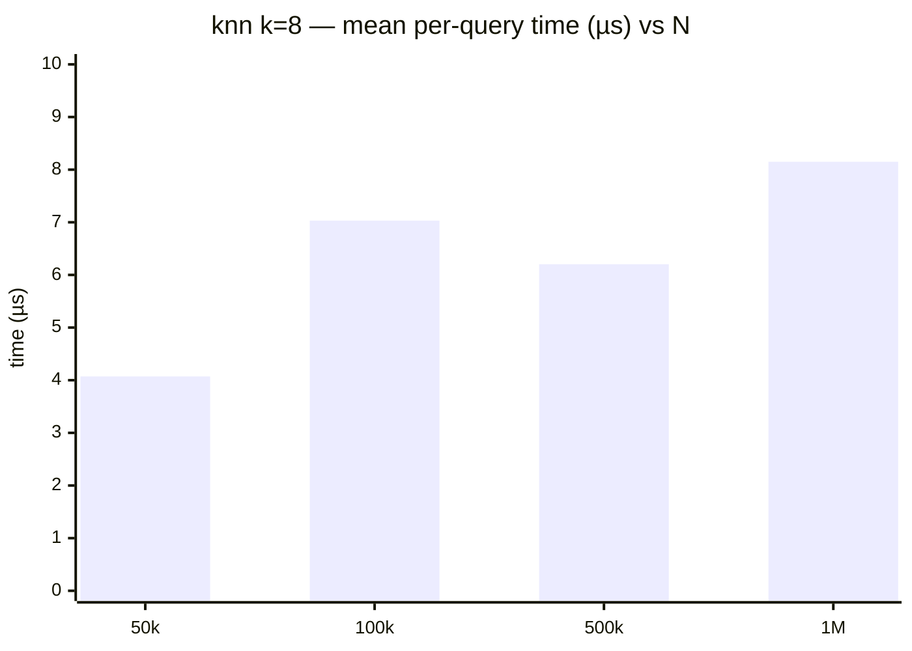

# Search benchmark

> Run date: 2026-05-14 · Source: `benchmarks/bench_search.cpp`

Per-query latency of `KDTree3::knn_search`, `radius_search`,
`hybrid_search`, plus N-sweep + radius-sweep, plus mixed insert/query
cycle throughput.

## Methodology

- **D = 3, scalar = float**. Points uniform in `[0, 100)^3`.
- **Single-query rows:** pre-built tree (`capacity = 1M`, prefilled with
  100,000 points unless noted). Query pool of 256 points drawn from the
  same uniform distribution with a different seed. The timed inner
  action picks a query via atomic round-robin to avoid both RNG cost in
  the hot path and degenerate cache reuse of a single fixed query.
- **N sweep:** tree capacity matches prefill (50k / 100k / 500k / 1M);
  `knn_search(q, k=8)` repeatedly with the same 256-point query pool.
- **Radius sweep:** N = 100k tree; `radius_search` at r ∈ {0.5, 2.0,
  5.0, 10.0}.
- **Mixed-cycle rows:** one cycle = one `insert(1k)` followed by 10,000
  `knn_search(q, k=8)` queries. Reported time is the full cycle. Two
  settings: cap = 100k prefilled to 10k; cap = 1M prefilled to 500k.
- **RNG:** `std::mt19937_64` with fixed seeds; `resolution = 1e-6f`.
- **Bench harness:** Catch2 v3.5.4, 5 samples per row.
- **Environment:** Intel Core Ultra 5 235 · Linux 6.17 x86_64 ·
  g++ 13.3.0 · CMake 3.31.9 · Release `-O3`.

## Results

5 samples per row.

### Single-query latency (N = 100k prefill)

| Query                       | Mean / call |  Stddev |
| --------------------------- | ----------: | ------: |
| `knn_search` k = 1          |    1.915 µs |   232 ns|
| `knn_search` k = 8          |    10.17 µs |  3.85 µs|
| `knn_search` k = 32         |    13.12 µs |  4.14 µs|
| `radius_search` r = 5.0     |    1.476 ms |   367 µs|
| `hybrid_search` k=32, r=5.0 |    17.34 µs |  4.98 µs|

### knn k=8 across live-point count

| N    | Mean / call |  Stddev |
| ---- | ----------: | ------: |
| 50k  |    4.071 µs |   617 ns|
| 100k |    7.032 µs |  1.73 µs|
| 500k |    6.203 µs |   237 ns|
| 1M   |    8.150 µs |  3.52 µs|

### radius_search across r (N = 100k)

| r    | Mean / call |  Stddev |
| ---- | ----------: | ------: |
| 0.5  |    1.232 ms |   203 µs|
| 2.0  |    1.078 ms |  22.7 µs|
| 5.0  |    1.111 ms |  52.8 µs|
| 10.0 |    1.093 ms |  68.2 µs|

### Mixed cycle (1 × insert(1k) + 10,000 × knn_search k=8)

| Prefill | Mean / cycle |   Stddev | Inferred per-query knn |
| ------- | -----------: | -------: | ---------------------: |
|     10k |    11.28 ms  |  9.44 µs |              ~1.1 µs   |
|    500k |    53.99 ms  |  1.76 ms |              ~5.4 µs   |

## What this tells us

**knn scales sublinearly with both `k` and `N`.** From k=1 to k=32
(32×) is ~6.9× cost; from N=50k to N=1M (20×) is ~2× cost. Both
trends point at the same mechanism: the bounded max-heap fills early
and tightens the leaf-scan skip threshold, pruning most of the
remaining tree.

**`radius_search` cost is essentially independent of radius in this
density regime.** 4× increase in `r` (0.5 → 10.0) moves the per-query
time by single-digit percent. With 100k points in `[0, 100)^3` the
partition leaves have small spatial extent; even r=0.5 fails to prune
most internal nodes because the per-axis split-plane gap squared
(`diff*diff`) is small relative to even the smallest sq_radius. The
dominant cost is descent + leaf-scan over the visited subtree, not
result-vector maintenance.

**`hybrid_search` is bounded by the `k` cap when `r` is large.** With
`(k = 32, r = 5.0)` the k-bound dominates the traversal pruning long
before `r` does; per-call time is comparable to `knn k = 32` (17 µs
vs 13 µs) and ~85× cheaper than pure `radius_search` at the same
`r`. Use `hybrid_search` whenever the caller has a sensible upper
bound on the result count.

**Mixed cycle is dominated by the query burst.** The 10k searches
account for the bulk of cycle time at both prefill levels; the 1k
insert contributes a few milliseconds at most. Per-query knn (k=8)
grows from ~1.1 µs at N=10k to ~5.4 µs at N=500k — sublinear in live
count, consistent with the `O(log N)` descent shape with cache-pressure
adjustments at larger working sets.
