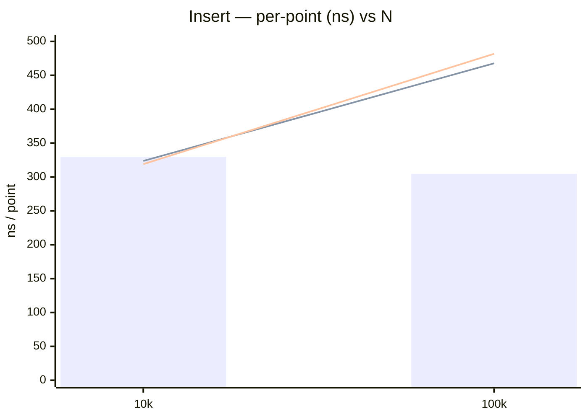
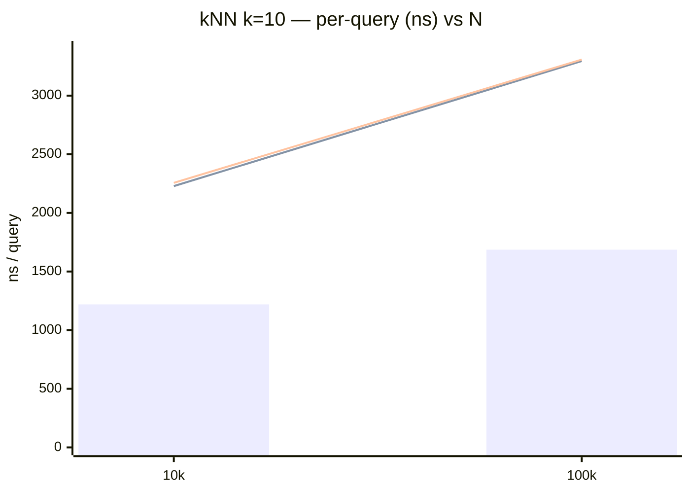
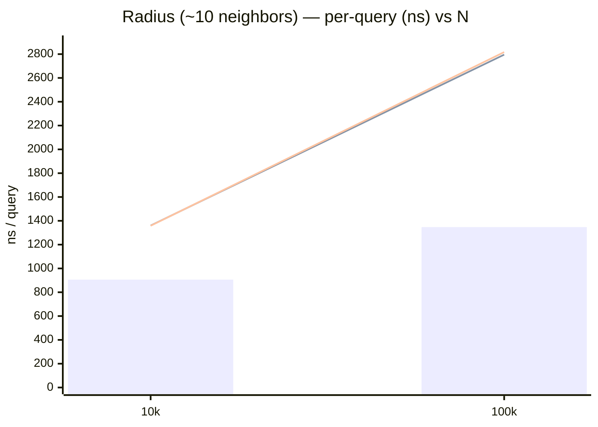
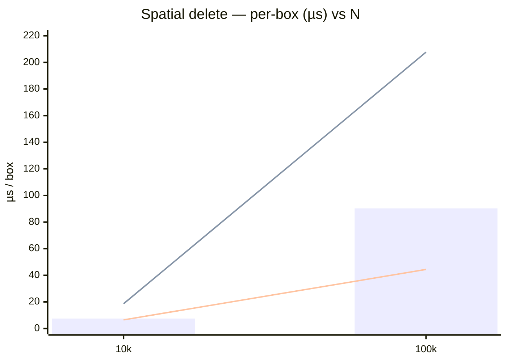
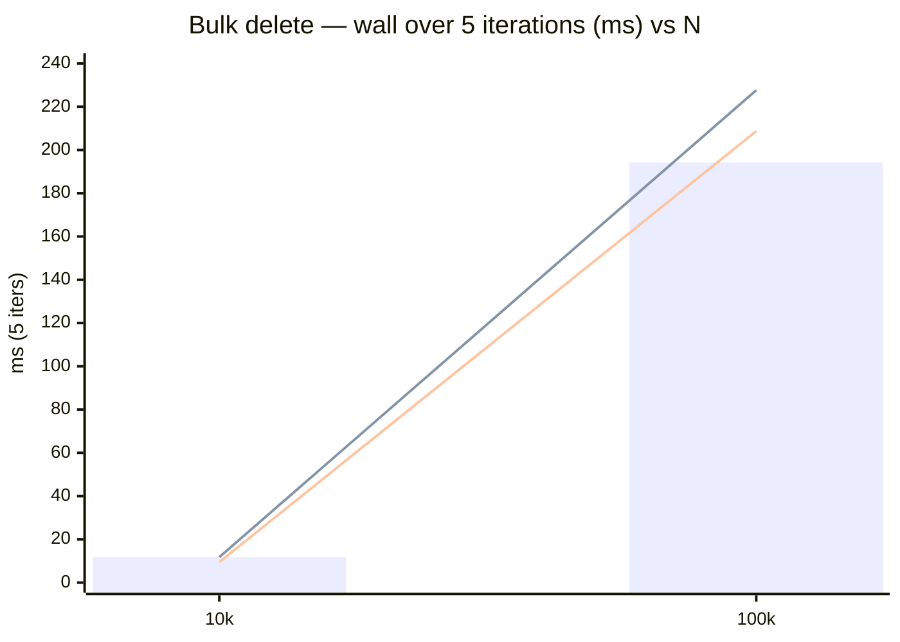
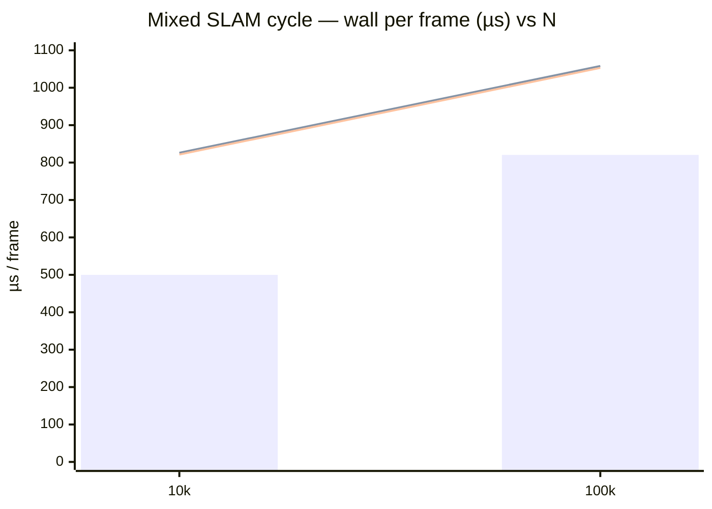

# copse vs. ikd-Tree benchmark

> Run date: 2026-06-16 · Source: `benchmarks/bench_perf_ikd.cpp`

Comparative microbenchmark of `copse::KDTree3` against the HKU MARS
ikd-Tree (`@c0e36a16`) on SLAM-shaped workloads, across three run modes.

## Methodology

- **D = 3, scalar = float**. Points uniform in `[0, 100)^3`; identical
  coordinates fed to both trees (converted to each tree's point type at the
  boundary). ikd-Tree is hard-wired 3D; 2D/4D have no counterpart.
- **Run modes:**
  - **(a) copse** — `copse::KDTree3`, single-thread, inline partial rebuild.
  - **(b) ikd bg-off** — ikd-Tree with `Multi_Thread_Rebuild_Point_Num = INT_MAX`
    (every rebuild synchronous). ikd still spawns its idle background thread in
    the constructor; it receives no work in this mode.
  - **(c) ikd bg-on** — ikd-Tree as shipped (`= 1500`); subtrees above the
    threshold rebuild on a second thread.
- **Config parity:** ikd `balance_param = 0.7` = our `alpha`; ikd
  `delete_param = 0.25` = our `tombstone_threshold`; ikd `Add_Points(_, false)`
  (downsample off) and our `resolution = 1e-6` (dedup never fires) → both
  insert every point, identical live counts.
- **Timing:** plain `int main()` loop, 3 warmup + 5 measured samples per row.
  Each row reports **wall-clock** (`steady_clock`) and **CPU time**
  (`getrusage` `ru_utime + ru_stime`, summed over all process threads). Read
  the two together: mode (c) shows wall < CPU exactly when its background thread
  does rebuild work on a second core.
- **Memory:** resident-set delta (`/proc/self/statm`) across the build phase
  is the headline; an analytic per-node estimate is tabulated alongside. ikd's
  fixed ~42 MB `Rebuild_Logger` array is called out separately from the
  per-point slope.
- **N ∈ {10k, 100k}.** 1M is dropped from the run — it is the dominant cost
  while the comparative signal is already saturated by 100k; the 1M memory
  figure is projected analytically below.
- **Environment:** Ubuntu 24.04 LTS · Linux 6.17 · Intel Core Ultra 5
  235 (14 cores) · 16 GB RAM · g++ 13.3.0 · CMake 3.31.9 · Release `-O3`.

## Insert (streaming, per-point)

Streaming batches of 10k; per-point over the streamed N.

| N    | Mode           | Wall mean | CPU mean | Wall stddev | Per-point |
| ---- | -------------- | --------: | -------: | ----------: | --------: |
| 10k  | (a) copse        |   3.30 ms |  3.30 ms |     15.2 µs |    330 ns |
| 10k  | (b) ikd bg-off |   3.24 ms |  3.29 ms |     69.7 µs |    324 ns |
| 10k  | (c) ikd bg-on  |   3.19 ms |  3.24 ms |     48.2 µs |    319 ns |
| 100k | (a) copse        |  30.46 ms | 30.46 ms |      334 µs |    305 ns |
| 100k | (b) ikd bg-off |  46.77 ms | 47.32 ms |      331 µs |    468 ns |
| 100k | (c) ikd bg-on  |  48.18 ms | 48.69 ms |     1.72 ms |    482 ns |

Bar = copse. Lines = ikd bg-off / bg-on. Tied at 10k; copse ~1.54× faster at 100k.

## kNN (k = 10, per-query)

1000-query pool, unbounded kNN on both sides.

| N    | Mode           | Wall mean | CPU mean | Wall stddev | Per-query |
| ---- | -------------- | --------: | -------: | ----------: | --------: |
| 10k  | (a) copse        |   1.22 ms |  1.22 ms |    19.1 µs  |   1220 ns |
| 10k  | (b) ikd bg-off |   2.23 ms |  2.26 ms |    40.1 µs  |   2228 ns |
| 10k  | (c) ikd bg-on  |   2.26 ms |  2.28 ms |    17.5 µs  |   2256 ns |
| 100k | (a) copse        |   1.69 ms |  1.69 ms |      109 µs |   1686 ns |
| 100k | (b) ikd bg-off |   3.29 ms |  3.33 ms |    76.4 µs  |   3295 ns |
| 100k | (c) ikd bg-on  |   3.31 ms |  3.34 ms |      115 µs |   3307 ns |

Bar = copse. Lines = ikd bg-off / bg-on. copse ~1.8–1.9× faster.

## Radius (density-matched, per-query)

Radius sized for ~10 expected neighbors at each N (r ≈ 6.2 at 10k, ≈ 2.9 at
100k); 1000-query pool. Both sides return the same ~10 neighbors per query.

| N    | Mode           | Wall mean | CPU mean | Wall stddev | Per-query |
| ---- | -------------- | --------: | -------: | ----------: | --------: |
| 10k  | (a) copse        |   0.91 ms |  0.91 ms |     6.9 µs  |    906 ns |
| 10k  | (b) ikd bg-off |   1.36 ms |  1.38 ms |    33.2 µs  |   1360 ns |
| 10k  | (c) ikd bg-on  |   1.36 ms |  1.38 ms |    25.8 µs  |   1359 ns |
| 100k | (a) copse        |   1.35 ms |  1.35 ms |    48.5 µs  |   1347 ns |
| 100k | (b) ikd bg-off |   2.80 ms |  2.87 ms |      123 µs |   2796 ns |
| 100k | (c) ikd bg-on  |   2.82 ms |  2.85 ms |      160 µs |   2817 ns |

Bar = copse. Lines = ikd bg-off / bg-on. copse ~1.5× (10k) → ~2.1× (100k) faster:
`radius_search` traverses with incremental box-distance pruning (the squared
distance from the query to each subtree's cell box), which prunes as tightly as
ikd's per-node AABB.

## Spatial delete (box batch, per-box)

A 4×4×4 grid of 64 half-open boxes over the lower-half extent, deleted in one
batched call (copse `box_delete`, ikd `Delete_Point_Boxes`), with a single
end-of-batch rebuild; per-box over the 64 boxes. Tree rebuilt fresh each rep.

| N    | Mode           | Wall mean | CPU mean | Wall stddev | Per-box |
| ---- | -------------- | --------: | -------: | ----------: | ------: |
| 10k  | (a) copse        |   0.48 ms |  0.48 ms |     3.8 µs  |  7.5 µs |
| 10k  | (b) ikd bg-off |   1.19 ms |  1.21 ms |    28.3 µs  | 18.6 µs |
| 10k  | (c) ikd bg-on  |   0.42 ms |  0.42 ms |     2.0 µs  |  6.5 µs |
| 100k | (a) copse        |   5.78 ms |  5.78 ms |    87.8 µs  | 90.3 µs |
| 100k | (b) ikd bg-off |  13.30 ms | 13.42 ms |    15.1 µs  |  208 µs |
| 100k | (c) ikd bg-on  |   2.84 ms |  4.15 ms |      329 µs | 44.4 µs |

Bar = copse. Lines = ikd bg-off / bg-on. **copse now beats ikd's single-thread mode
~2.3×** (90 vs 208 µs/box at 100k); only the second-core bg-on mode is faster
(44 µs, wall 2.84 < CPU 4.15 — offloaded). Batching the delete collapses 64
per-call rebuild triggers into one end-of-batch rebuild, so the redundant
rebuilds that dominated the per-call path are gone.

## Bulk delete (repeated insert + big delete)

Each iteration inserts an N/2 batch then deletes the `x < extent/2` half (≈ a
large fraction) in one call; measured over 5 iterations. A *single* bulk delete
is meaningless for bg-on — it schedules the rebuild on the background thread and
returns, so the work escapes the timed call. Repeating insert+delete keeps each
deferred rebuild inside the window (it must overlap with, or block, the next
iteration), so the second core's effect is captured honestly.

| N    | Mode           | Wall (5 it) | CPU (5 it) | Wall stddev |
| ---- | -------------- | ----------: | ---------: | ----------: |
| 10k  | (a) copse        |    11.78 ms |   11.78 ms |     45.7 µs |
| 10k  | (b) ikd bg-off |    11.78 ms |   11.89 ms |      170 µs |
| 10k  | (c) ikd bg-on  |     9.49 ms |   12.37 ms |      195 µs |
| 100k | (a) copse        |   194.21 ms |  194.20 ms |     1.02 ms |
| 100k | (b) ikd bg-off |   227.63 ms |  230.05 ms |     2.61 ms |
| 100k | (c) ikd bg-on  |   208.70 ms |  276.69 ms |    21.82 ms |

Bar = copse. Lines = ikd bg-off / bg-on. **bg-on's wall < CPU here (12.37 vs 9.49
at 10k; 276.69 vs 208.70 at 100k) — real offload to the second core, which buys
it a wall-clock edge over bg-off.** But it costs ~33% more total CPU, and even
so copse (single-thread) is the fastest in wall at 100k (194 ms) — its partial
rebuild is cheaper than ikd's full-subtree rebuild, with no thread to feed.

## Mixed SLAM cycle (per-frame)

A SLAM-shaped loop on a pre-built map: each frame inserts a 1k-point scan, runs
200 kNN (k=10) queries, and deletes one box every third frame. Per-frame over
10 frames; copse capacity holds the base map plus all inserts (no FIFO eviction).

| N    | Mode           | Wall / frame | CPU / frame | Wall stddev |
| ---- | -------------- | -----------: | ----------: | ----------: |
| 10k  | (a) copse        |     0.500 ms |    0.500 ms |     8.6 µs  |
| 10k  | (b) ikd bg-off |     0.826 ms |    0.829 ms |    21.4 µs  |
| 10k  | (c) ikd bg-on  |     0.821 ms |    0.831 ms |     7.3 µs  |
| 100k | (a) copse        |     0.820 ms |    0.820 ms |    12.3 µs  |
| 100k | (b) ikd bg-off |     1.058 ms |    1.069 ms |    20.1 µs  |
| 100k | (c) ikd bg-on  |     1.053 ms |    1.064 ms |    32.3 µs  |

Bar = copse. Lines = ikd bg-off / bg-on. copse ~1.6× (10k) → ~1.3× (100k) faster.
**bg-on ≈ bg-off with wall ≈ CPU** — steady small per-frame churn keeps each
rebuild below ikd's 1500-point offload threshold, so they run synchronously and
the second core stays idle.

## Memory

| N    | Mode           | RSS delta | Analytic nodes | Bytes/point |
| ---- | -------------- | --------: | -------------: | ----------: |
| 10k  | (a) copse        |  ~0.1 MB  |        0.47 MB |        49.0 |
| 10k  | (b)/(c) ikd    |  41.96 MB |        1.30 MB |       136.0 |
| 100k | (a) copse        |  ~0–4 MB  |        4.67 MB |        49.0 |
| 100k | (b)/(c) ikd    |  41.96 MB |       12.97 MB |       136.0 |

copse is **~2.8× leaner per point** (49 vs 136 bytes) and carries no fixed
constant. ikd's RSS is pinned by the **~42 MB `Rebuild_Logger` array**
(`Operation_Logger_Type q[1000000]`) per object, which dominates at these N and
only amortizes far out — even at the projected 1M the constant still sits on top
of ~136 MB of ikd nodes vs ~49 MB for copse. The gap is structural: copse stores
points in a flat SoA (≈17 B/slot + a small bucketed node array), ikd chases
136 B pointer-laden nodes. (copse's RSS delta is within page-noise at these N; the
analytic slope is the reliable figure.)

## Fairness caveats

- **Downsample off on both sides** — neither tree drops points; live counts
  match, so per-point/-query figures are over the same N.
- **Delete is lazy on both** but reclamation cadence differs; `delete_param`
  and `tombstone_threshold` are matched at 0.25 so the rebuild trigger fires
  comparably.
- **Wall vs CPU** — mode (c)'s background thread trades wall-clock for a second
  core. Read both columns: wall < CPU marks genuine offload (spatial + bulk
  delete); wall ≈ CPU means the thread was idle (everything else).
- **A single bulk delete is not measurable for bg-on** — it defers the rebuild
  past the call. The bulk-delete workload repeats insert+delete so the deferred
  work lands inside the window.
- **ikd's fixed 42 MB** is a constant, not a per-point cost — separated above.
- **Box convention** — both use half-open `min <= p < max`. **copse FIFO eviction**
  has no ikd analog; the mixed and bulk workloads size copse capacity above the
  live count so eviction never fires.
- Results are sets, not sequences; tie-break order is not compared.

## What this tells us

- **copse wins every read/insert path, the mixed SLAM loop, and memory.** Insert
  ~1.54×, kNN ~1.9×, radius ~2.1×, mixed cycle ~1.3–1.6× at 100k, and ~2.8× less
  memory per point with no fixed constant — flat SoA layout, bounded-heap kNN,
  and box-distance radius pruning, all single-threaded.
- **Batched spatial delete now favours copse over single-thread ikd** (~2.3× at
  100k). Scoping the rebuild trigger to the touched nodes, then batching the 64
  deletes into one end-of-batch rebuild, took copse's per-box cost ~503 → ~392 →
  ~90 µs at 100k. Only ikd's bg-on mode is faster, and only by offloading the
  rebuild to a second core (wall < CPU); single-threaded, copse leads.
- **ikd's second core only earns its keep on big batched rebuilds.** On the bulk
  churn bg-on shows wall < CPU but spends ~33% more CPU, and copse still wins wall
  at 100k (192 vs 221 ms) — its partial rebuild is cheaper than ikd's full-subtree
  rebuild. Under the steady mixed SLAM cycle, per-frame rebuilds stay below ikd's
  1500-point offload threshold, so bg-on ≈ bg-off (wall ≈ CPU) and copse leads.
- **Net:** copse wins every workload single-threaded — insert, kNN, radius, spatial
  delete, bulk churn, mixed SLAM, and memory. ikd is only ahead when its second
  core can offload a large rebuild (one-shot/bulk deletion), a narrow window.
